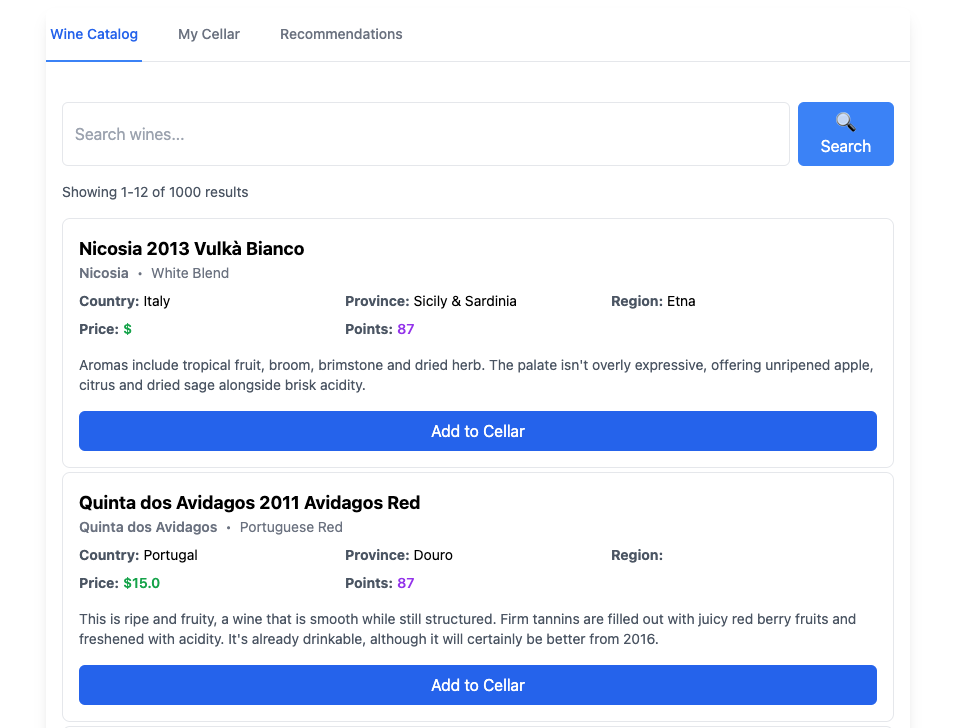

# `wineinfo`

A sample web application for Junction demos.

The app is a wine catalog that's built with a React frontend and multiple
FastAPI backend services to handle traditional full-text search, LLM-based
vector search, and saving bottles to a collection.

## Generating Vector Data

We live in a post-GPT era, of course our application requires a vector database.
The demo app can run without any data, but it'll be pretty boring.

Generating the data is best done in your local environment, rather than in a
container. In this directory, run

```bash
python3 -m venv .venv
source .venv/bin/activate
pip install --upgrade uv
uv pip install -r backend/requirements.txt
python3 backend/bin/build_data.py
```

## Deploying

This demo focuses on dynamic discovery in Kubernetes. To make it easy to run
without being a Kubernetes whiz, it runs in a self-contained [`k3d`][k3d]
cluster.

To run the demo you need `docker` and `kubectl` installed. This README won't
cover installing those tools.

Once you've gotten both `docker` and `kubectl` set up, install `k3d` by running:

```bash
curl -s https://raw.githubusercontent.com/k3d-io/k3d/main/install.sh | bash
```

or check out the [official k3d installation instructions][k3d-install]

[k3d]: https://k3d.io/
[k3d-install]: https://k3d.io/v5.7.4/#install-script

Once you've installed `k3d` (check that it works by running `k3d version`) you
can start the demo:

```bash
./deploy/wineinfo.sh
```

Once you're done, point your browser at <http://localhost:8010> and you should
see the working wine UI.



## Demo

Once you're through clicking around the WineInfo site for the first time, head
on over to [the first part of the demo](demo/01_intro.md).

## For developers of the demo

### Developing the demo code with hot reload

The easiest way to develop the demo is using the interactive mode of the various
web servers. run the following in 5 different shells, then, go to
`http://localhost:3000/`:

Frontend (defaults to port 3000):
```
cd frontend
npm install
npm run dev
```

Backend:
```
python3 -m venv .venv
source .venv/bin/activate
pip install -r backend/requirements.txt
python3 backend/bin/build_data.py
fastapi dev backend/app/backend_app.py --port 8000
```

Persist:
```
source .venv/bin/activate
fastapi dev backend/app/persist_app.py --port 8004
```

Recs:
```
source .venv/bin/activate
fastapi dev backend/app/recs_app.py --port 8003
```

Search:
```
source .venv/bin/activate
fastapi dev backend/app/search_app.py --port 8002
```

Catalog:
```
source .venv/bin/activate
fastapi dev backend/app/catalog_app.py --port 8001
```
